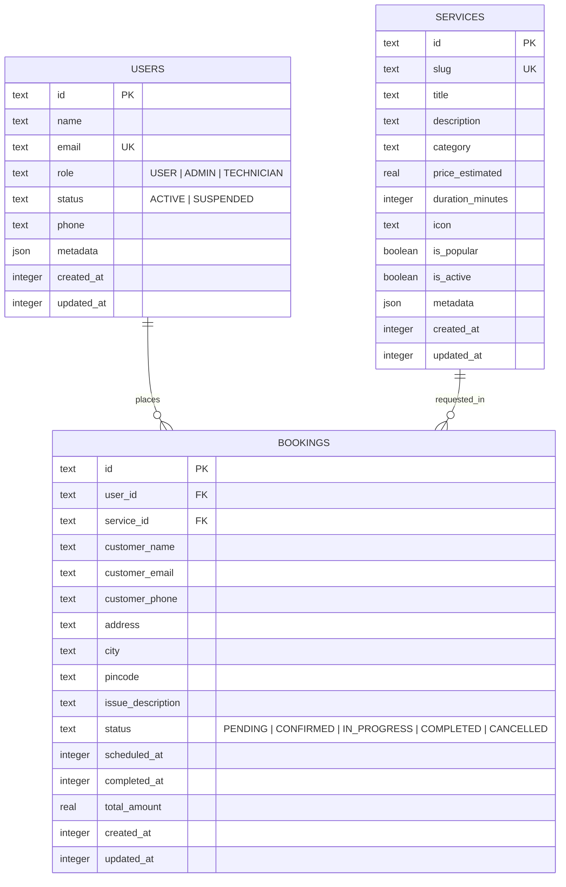

# Cloudflare D1 Database Schema Documentation

Reparzo utilizes **Cloudflare D1**, a globally distributed, serverless relational database built on SQLite with primary replication. Schema definitions are written declaratively using **Drizzle ORM** in `backend/src/db/schema/`.

---

## 1. Entity Relationship Overview



---

## 2. Table Specifications & Indexing Strategy

All indexes adhere strictly to the **Equality-Range-Sort (ERS)** rule to ensure sub-millisecond index-only searches without temporary B-tree allocations:

### `users` Table
- `id` (TEXT, PK): Unique prefixed identifier (`usr_...`).
- `email` (TEXT, UNIQUE): User email address.
- `idx_users_email` (UNIQUE): Fast lookups during login/auth.
- `idx_users_role_status`: Composite index `(role, status)` for role-based dashboard filtering.

### `services` Table
- `id` (TEXT, PK): Unique service ID (`srv_...`).
- `slug` (TEXT, UNIQUE): SEO-friendly URL slug.
- `idx_services_category_active`: Composite index `(category, is_active)` for category browsing.
- `idx_services_slug`: Unique/covering index for single service lookups.

### `bookings` Table
- `id` (TEXT, PK): Unique booking ID (`bkg_...`).
- `user_id` (TEXT, FK): Optional relationship to registered user (`onDelete: 'set null'`).
- `service_id` (TEXT, FK): Required relationship to service (`onDelete: 'restrict'`).
- `idx_bookings_user_status`: Composite index `(user_id, status)` for customer booking history.
- `idx_bookings_status_scheduled`: Composite index `(status, scheduled_at)` for technician dispatch queries.

---

## 3. Migration Commands

```bash
# Generate SQL migration file in backend/drizzle/
npm --prefix backend run db:generate

# Execute locally on wrangler SQLite isolate
npm --prefix backend run db:migrate

# Apply to production Cloudflare D1
npm --prefix backend run db:migrate:remote
```
